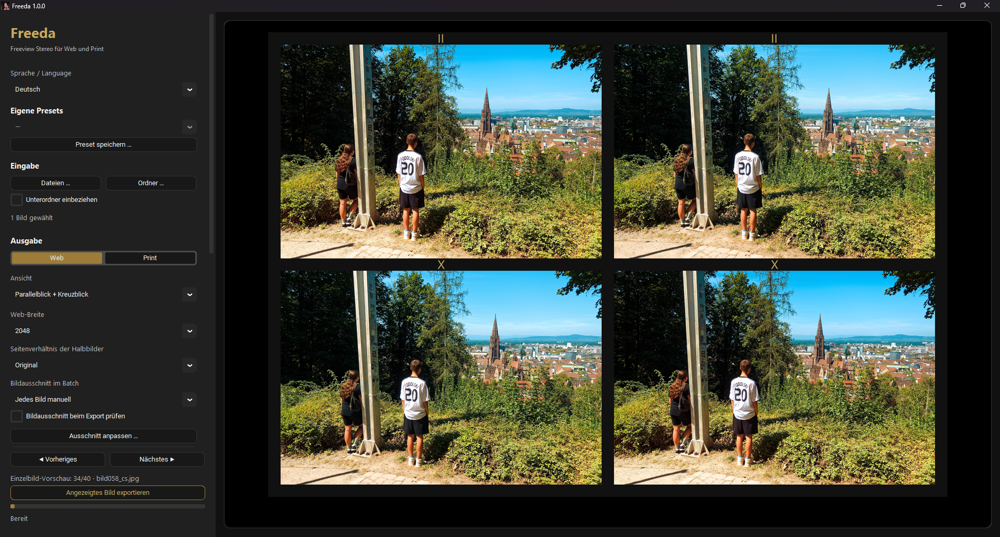

# Freeda 1.1

[Deutsch](README_DE.md)

Freeda is a local desktop tool for framing and exporting full side-by-side stereo images as Freeview graphics for web and print. Parallel viewing, cross-eyed viewing and combined layouts share the same controls for framing, captions and cropping.

Freeda works completely locally: no account, no cloud, no tracking and no automatic downloads during use.

## Portable Windows release

[Download Freeda 1.1](https://github.com/muelli1975/Freeda/releases/tag/v1.1)

1. Extract the complete `Freeda_1.1_Windows_x64.zip` into a writable folder.
2. Start `Freeda.exe`.
3. Keep the application folder together; `_internal`, `tools` and the other supplied files belong to the application.

No separate Python installation is required. Language and saved presets are stored in `settings.json` beside `Freeda.exe`. Copy this file and your `logos` folder, if present, to the new application folder when updating. The executable is not Authenticode-signed.

## macOS and Linux builds

The same release page provides Linux x64, macOS Apple Silicon and macOS Intel packages. Extract the complete package into a writable folder. On Linux, start `Freeda` in a graphical desktop session; glibc 2.35 or newer is required. On macOS, start `Freeda.app` from the package for your processor. Settings are stored beside the app bundle. ExifTool is included in `tools` beside the Linux executable and in `Freeda.app/Contents/MacOS/tools` on macOS. Linux and macOS need a working Perl interpreter for metadata transfer; the Windows package includes its own runtime.

All four variants are built from the same tagged source. Automated tests and packaged startup checks run on every platform; GUI export checks also run on Windows and Linux. Manual desktop testing on macOS and Linux is still pending. The macOS applications are ad-hoc signed and are not Apple-notarized.

## Quick start

1. Open one full-SBS image, several files or an image folder.
2. Choose **Web** or **Print** and the viewing layout.
3. Set the output width or print dimensions, frame colours and captions.
4. Use **Adjust crop** to position the crop. In Web mode you can also choose a per-eye aspect ratio.
5. Check the preview. Use Previous/Next to inspect other images.
6. Start the export. Single-image export processes the displayed image; batch export processes the entire selection.

The first launch uses German. Select English in the language control; Freeda remembers the last language. Other settings start at their defaults: Web, 2048 pixels, 4% frame width, 4% caption size, 300 dpi and 0 mm bleed with bleed preview enabled. Presets are applied only when explicitly selected.

## Supported inputs

Freeda opens JPEG, PNG, TIFF, BMP and WebP images containing two equal-sized views side by side: left eye on the left, right eye on the right (`L|R`). It expects full-SBS images, not horizontally compressed half-SBS images. It does not generate stereo depth or align the two views.

## Viewing layouts

- **Parallel viewing:** `L|R`.
- **Cross-eyed viewing:** `R|L`.
- **Parallel viewing + cross-eyed viewing:** both pairs in two rows.
- **L–R–L:** three views in one row; the left pair supports parallel viewing and the right pair supports cross-eyed viewing.

The II/X viewing symbols occupy a frame-width strip. In L–R–L they sit above the gaps between views. Captions appear below the images; their area can grow independently of the symbol strip. Long L–R–L captions shrink to 75% of the selected size if necessary, then end with an ellipsis. With proportional frames, the lowest caption area uses one frame width less padding.

## Web and print

**Reset crop** resets the position and zoom of the displayed image while retaining the selected aspect ratio and other images’ crops.

Web sizes set the **long edge in pixels** of the complete finished graphic, including the frame and caption or logo. For example, 2048 sets the width of a landscape graphic or the height of a portrait graphic. Use a preset, a custom size or Original to retain the image resolution. Per-eye aspect ratios can remain original or use a preset or a custom ratio.

Print offers preset and custom dimensions, freely entered positive integer dpi and a freely entered decimal **Bleed margin in mm**. Bleed starts at 0 mm; its preview is enabled so an added margin is immediately visible. The print format is filled completely; each eye image’s aspect ratio follows from paper size, layout, frame and captions. Single images export their preview crop directly. Enable **Review crop before export** to open the crop dialog; manual batch cropping remains available. Bleed uses the frame colour. Optional cutting lines and crop marks are grey. The preview fits the available space; its display scale is independent of export dpi.

Frame width is adjustable from 0 to 5%, with 4% as the default. Caption font and size are adjustable, with 4% as the default. The font chooser previews the entered caption and truncates long samples with an ellipsis without changing the caption. The caption font selection applies only to captions; II/X symbols retain the standard font. Both percentages refer to the width of one eye image and work the same way in Web and Print. Caption padding is based on the font size: approximately 0.4 times above and 0.6 times below, with extra leading only between lines.

**Image shape** offers two options: **Rectangle / rounded corners** and **Classic arch**. For Rectangle / rounded corners, **Top radius** and **Bottom radius** independently control the upper and lower pairs of image corners. A value of 0 keeps those corners rectangular; equal values round all corners equally. Both radii refer to view width. Classic arch instead shows arch height, also as a percentage of view width. Switching retains hidden radius values, which do not affect the arch. All shapes work in Web, Print and crop previews. Existing presets retain their previous appearance. Contour controls use sliders with the current value in the label, matching the frame and caption controls. Usual ranges are 0–25% for image radii, 0–5% for the outer radius and 0–50% for arch height; steps are 0.5%, 0.1% and 0.5% respectively. Ranges respect the current geometry and extend for larger stored values where possible; synchronizing a slider never changes an existing preset value.

**Outer radius** is available for both shapes, refers to total output width and rounds the finished graphic, including bleed when present. Image radii and outer radius are independent; oversized radii are capped at the geometrically possible size. PNG keeps transparent outer corners; JPEG fills them with black in Web and white in Print, as shown in the preview. Inner image corners reveal the selected frame colour.

The 16 colour presets are arranged dark first, then light, with **Night gold** first and still the default. The original ten combinations remain available. Cream, Parchment, Honey card, Sage paper, Blue grey and Dusty rose add light card backgrounds with dark captions. Custom colours remain available.

## Card templates and precise print margins

Choose a **Card template** for a ready-made layout, or keep **Free layout** for proportional frames. Templates change the paper size, margins, image shape and viewing layout; they retain your colours, caption font and caption text.

| Template | Finished card | Image windows | Gap between windows |
| --- | --- | --- | --- |
| Holmes card | 177.8 × 88.9 mm (7 × 3½ inches) | 76.2 × 76.2 mm | 1.6 mm |
| Stereo card 18 × 9 cm | 180 × 90 mm | 76.2 × 76.2 mm | 2.6 mm |
| Raumbild card 13 × 6 cm | 130 × 60 mm | 59 × 52 mm | 2 mm |

These are editable layout suggestions, not universal standards for historical viewers. Holmes and 18 × 9 cm start with an arch; Raumbild starts rectangular. All use parallel viewing without II/X symbols. Check suitability for your viewer and the stereo content: image-centre distance alone does not determine viewing comfort.

**Adjust margins and image windows** opens the precise settings. Choose **Exact margins in mm** to set the left/right outer margin, top margin, centre gap and bottom area independently. For two image rows, an additional row-gap field appears. The bottom area includes the caption and applies to each row. It does not change automatically when captions grow: Freeda reports insufficient space instead of shrinking the image windows. The displayed window dimensions and image-centre distance update immediately. Changed templates are marked as adjusted; **Reset template** restores their layout.

In Print, captions can also use a freely entered size in points. Optional text padding above and below is entered in mm; empty fields use the automatic font-based spacing. Exact margins replace the percentage frame control; point sizing replaces the percentage caption control. Both settings are saved in portable presets. Existing 1.0 presets remain usable.

Paper size, margins and crop aspect are calculated in millimetres before conversion to pixels, so changing dpi affects resolution rather than card geometry. Bleed is added outside the finished card in the frame colour. Print exported cards at **100% / actual size**, without automatic page fitting.

For plain stereo cards, select Print, parallel or cross-eyed viewing, a 0% frame and an empty caption. The two views then meet directly without an outer frame or centre bar and fill the print format. **Show viewing symbols** independently toggles II/X; at 0% they are automatically omitted. Symbols remain enabled by default. Frame width and symbol visibility are saved in presets.

## Logos instead of caption text

Under **Caption**, choose **Text** or **Logo**. **Choose logo** imports a raster image; transparent PNG is particularly suitable. Logos appear centred and identically below every stereo view, including all three L–R–L views and both rows of the combined layout. Switching modes retains the text and logo selection during the session. Until a logo is selected, the preview remains visible without a caption and asks for a logo; export stays disabled.

The logo's aspect ratio is preserved and its width is capped at 90% of one view. Height starts at 8% of view width and is adjustable from 1–20%; Print additionally accepts a positive height in mm. The requested height is a maximum: very wide logos scale down further to fit. Automatic padding is 15% of the resulting logo height above and 25% below. In Print, the same precise padding fields can override these values in mm.

With exact Print margins, the logo must fit inside the bottom area. Freeda reports insufficient space instead of changing the image windows. Proportional layouts grow their footer area as for captions. Logos are scaled with Lanczos; their transparent pixels show the chosen frame colour. JPEG/PNG outer-corner behaviour remains unchanged.

Freeda copies the chosen file, without altering it, into `logos` beside `settings.json`. Presets save a relative reference and the logo size, so they remain usable when the complete program folder moves. When updating, copy both `settings.json` and `logos`. Missing or unreadable logo files produce a clear message. Replacing a logo leaves earlier copies available to saved presets. Text remains the startup default; a logo preset is applied only when selected.

## Image crops

**Adjust crop** applies the same relative crop to both stereo views. **Reset** restores zoom and position. A toggleable rule-of-thirds grid appears separately over each view and is never exported. Batch cropping can inspect every image or reuse the same relative crop.

Crops normally remain in memory for the current session. Enable **Remember image crops** to load and save confirmed crop changes in `freeda-crops.json` in each image folder. Entries use filenames and relative coordinates, separately for Web and Print. Move the folder together with this file to retain its crops.

The checkbox is off at startup. Turning it off leaves saved files intact. Resetting a crop removes only the entry for that image and mode. Original images remain unchanged.

## Batch processing and navigation

Opening a single image also makes the other supported images in its folder available for preview navigation. Previous/Next and Page Up/Page Down move through them without wrapping at the ends. Single-image export still processes only the displayed image.

Selecting several files or a folder creates a batch. Navigation changes the preview; batch export processes the entire selection. Subfolders are included only when the corresponding checkbox is enabled.

## Output and folders

By default, “Use subfolder in input folder” is enabled: Freeda writes to `output/web` or `output/print` inside the input folder. A custom output folder can be selected and remains visible in grey when the input subfolder option is enabled. The actual output destination is shown separately. Input and output dialogs remember separate starting folders during the session. Folder batches retain their relative folder structure. Settings are locked during export.

Files use names such as `image_freeda_web.jpg` or `image_freeda_print.png`. Existing output images at the same destination are overwritten on export. Original input images remain unchanged. Exports are JPEG or PNG; Freeda renders the images in 8-bit RGB.

## Metadata

Where possible, Freeda copies metadata from the source image to each finished JPEG or PNG with the bundled ExifTool. Capture date, camera, exposure, original focal length, copyright and GPS information are retained where the output format supports them. Embedded previews, thumbnails, Orientation and MPF/MPO container data are excluded.

Output dimensions describe the newly rendered image, including any bleed. Source resolution values are excluded; Print retains the chosen export dpi. Metadata copying never changes source files and creates no `_original` backup files. If metadata transfer fails, the exported image remains valid and Freeda shows a nonfatal warning in the selected language.

ExifTool 13.59 is supplied separately under `tools` with its original support files and licence notices. It runs only during export, without a console window on Windows. No download occurs during application use.

## Settings and language

German and English are available. Language and named presets are stored locally in `settings.json` beside the application, keeping the complete program portable. Saved presets contain export and appearance settings; input-image paths, output paths, image-specific caption text and individual crops are not part of a preset.

The last language is restored at startup. Other controls use the standard values until a preset is selected. Individual crop files stay in the respective image folders rather than in the application settings.

## Source code and long-term use

The [GitHub repository](https://github.com/muelli1975/Freeda) contains the source and build scripts. Development requires Python 3.12 and the dependencies in `requirements-lock.txt`. `build_windows.ps1` prepares the verified ExifTool distribution and packages Windows; For Linux and macOS, run `python scripts/prepare_exiftool.py` followed by `scripts/build_unix.py` on the respective system. Build downloads use the publisher’s pinned archive checksums. The release workflow runs tests before publishing the platform packages.

Freeda is intended to remain usable independently of accounts or online services. Active maintenance, support, issue handling or pull-request review cannot be guaranteed.

## License

Freeda is licensed under the [MIT License](LICENSE), copyright Christoph Müller. Third-party components retain their own licences. The packages include [third-party notices](THIRD_PARTY_NOTICES.md) and licence copies in `licenses`.
